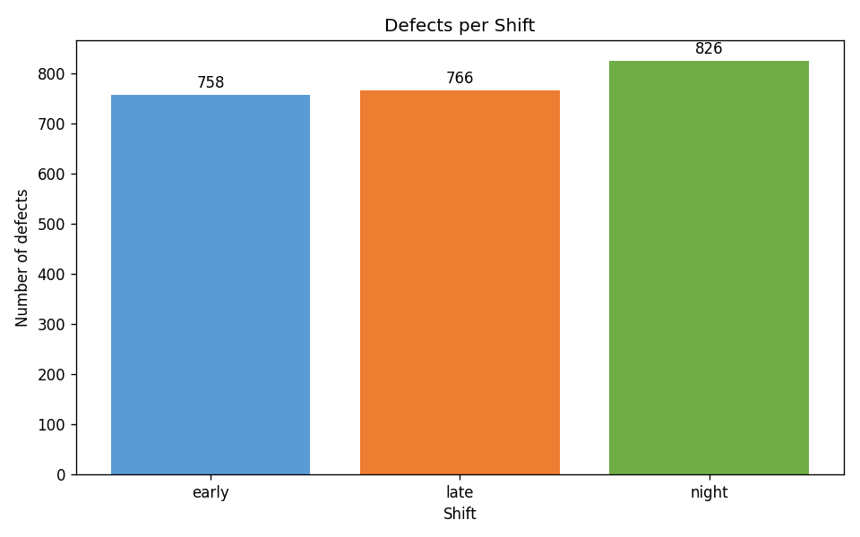
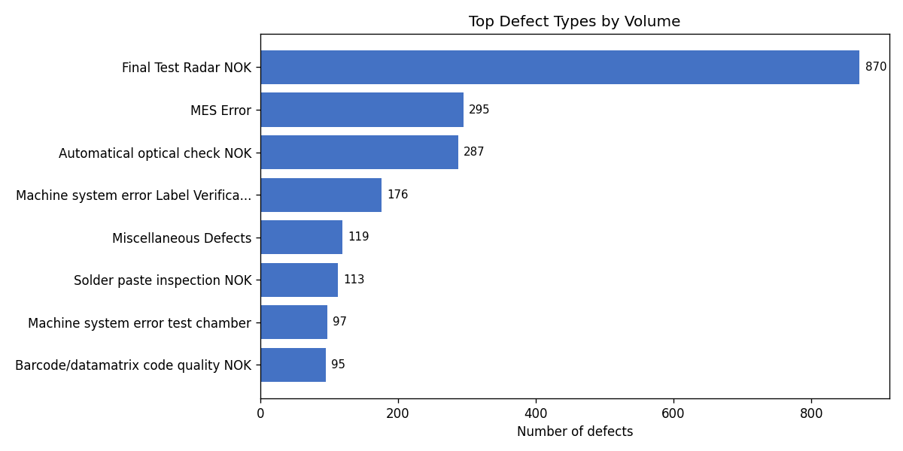
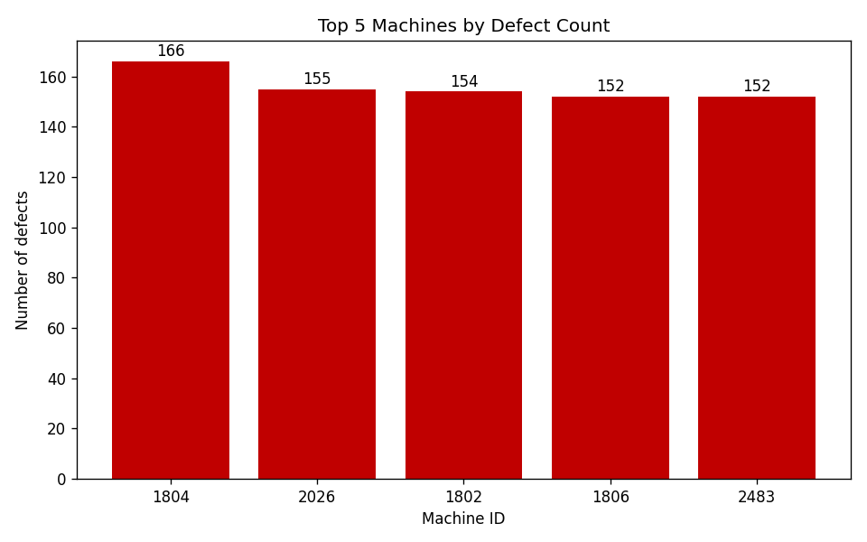
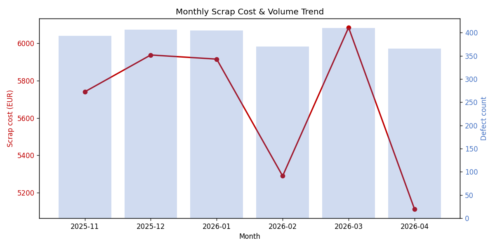
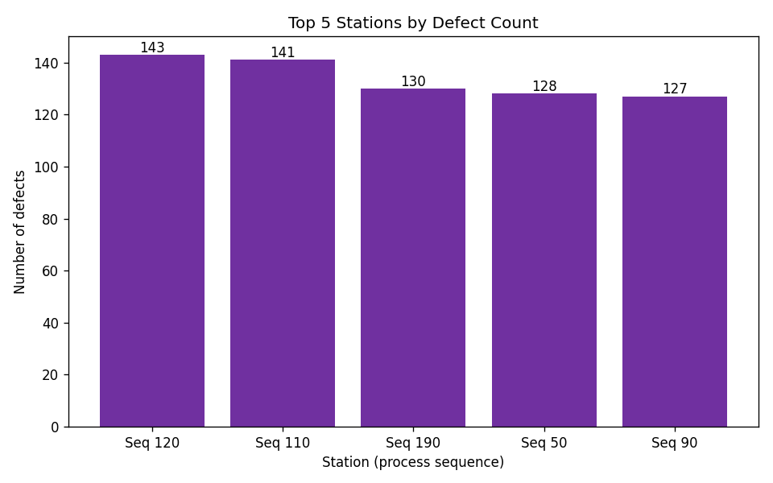

# Radar Production Defects: SQL Data Cleaning & EDA

This is a self-contained SQL and Python portfolio project I completed to
demonstrate how I clean messy manufacturing data, explore business drivers,
visualize results, and translate query outputs into practical manufacturing
recommendations.

The project works with a radar production defect log provided as a CSV file.
Each row represents a defective part flagged during assembly or final testing.
I built the workflow myself: data cleaning in T-SQL, exploratory analysis,
chart generation in Python, and interpretation of the results.

## Project Highlights

- Cleaned a raw defect table by removing true duplicates,
  standardizing categorical values, converting imported text fields to proper
  SQL types, and handling missing defect information.
- Used SQL Server / T-SQL features including CTEs, window functions,
  `ROW_NUMBER()`, `DENSE_RANK()`, grouped aggregations, joins, and date
  conversion.
- Analyzed scrap by defect type, shift, machine, station, material, production
  order, and month.
- Rebuilt summary charts from the cleaned CSV with Python, pandas, and
  matplotlib.

## Repository Structure

```
sql-data-cleaning-eda-portfolio/
├── README.md
├── requirements.txt
├── data/
│   ├── radar_production_defects.csv
│   └── radar_production_defects_CLEAN.csv
├── scripts/
│   └── generate_charts.py
├── sql/
│   ├── 00_create_table.sql
│   ├── 01_data_cleaning.sql
│   ├── 02_eda.sql
│   └── 03_export_clean_csv.sql
└── charts/
    ├── chart_1_defects_by_shift.png
    ├── chart_2_top_defects.png
    ├── chart_3_top_machines.png
    ├── chart_4_monthly_trend.png
    └── chart_5_top_stations.png
```

## Dataset Columns

| Column | Description |
|---|---|
| `DATE_CREATED` | Date when the defect was logged |
| `SHIFT_NAME` | Production shift: early, late, or night |
| `PART_SERIAL_NUMBER` | Part serial number |
| `MATERIAL_R3` | Radar SKU / material number |
| `MACHINE_ID` | Machine that detected or logged the defect |
| `PRODUCTION_ORDER_ID` | Production order / batch identifier |
| `SEQUENCE` | Station number on the line |
| `DESCRIPTION` | Defect description |
| `CODE` | Numeric defect code |
| `MATERIAL_COST` | Recorded material cost in EUR |

Note for Excel users: if the CSV is opened by double-clicking, Excel may display
`PART_SERIAL_NUMBER` in scientific notation. Import the CSV through
Data > From Text/CSV and set `PART_SERIAL_NUMBER` as Text to preserve the full
serial number.

## Data Quality Issues Handled

The raw CSV includes the kinds of issues that often appear in manufacturing
exports:

| Issue | Cleaning approach |
|---|---|
| Exact duplicate rows | Removed with `ROW_NUMBER()` over all value columns |
| Shift names with inconsistent casing or whitespace | Trimmed and converted to lowercase |
| Blank descriptions where a valid code exists | Backfilled by joining on defect code |
| Rows with no code and no description | Deleted as unusable records |
| Multiple labels for the same AOI defect | Standardized to one canonical description |
| Dates imported as text | Converted to SQL `DATE` |
| Empty cost fields | Preserved as `NULL` for analysis |

After cleaning, the working table contains **2,350 records**.

## SQL Workflow

### 0. Raw Data Import

Import `data/radar_production_defects.csv` into SQL Server as a table named
`dbo.defects`.

The optional [`sql/00_create_table.sql`](sql/00_create_table.sql) file is only
there if you want to create the empty table yourself before importing. If SSMS
creates `dbo.defects` directly from the CSV, you can skip that file.

### 1. Data Cleaning

[`sql/01_data_cleaning.sql`](sql/01_data_cleaning.sql) creates a staging table
from the raw import and performs the cleaning pipeline:

1. Remove duplicate records.
2. Standardize shift names and defect descriptions.
3. Convert dates, numeric IDs, defect codes, and material costs to appropriate
   SQL types.
4. Remove records with no usable defect information.

The file `data/radar_production_defects_CLEAN.csv` is an exported copy of the
cleaned `dbo.defects_staging` table after this step. It is included so the
final cleaned dataset can be reviewed without rerunning SQL Server. Missing
material costs are shown as `NULL` in the clean CSV.

To recreate the clean CSV from SQL Server, run
[`sql/03_export_clean_csv.sql`](sql/03_export_clean_csv.sql), then right-click
the results grid and choose `Save Results As...`.

If the saved file has no column headers, enable this SSMS setting first:
`Tools > Options > Query Results > SQL Server > Results to Grid > Include
column headers when copying or saving the results`.

### 2. Exploratory Analysis

[`sql/02_eda.sql`](sql/02_eda.sql) answers the main analysis questions:

- Which defect types create the most scrap cost?
- Which shifts, machines, and stations show the highest defect volume?
- Which materials and production orders contribute most to cost?
- Is scrap trending upward or downward over time?
- Which machines and defect types appear most often within each month or shift?

## Analysis Summary

The cleaned table covers **2,350 defect records** from November 2025 through
April 2026, with **€34,076.37** in recorded material cost.

- `Final Test Radar NOK` is the largest defect category: 870 records, 37.0% of
  all defects, and 36.2% of total recorded cost.
- The top three defect categories account for about 61% of total recorded cost.
- Night shift has about 9% more defects than early shift.
- Monthly scrap cost stays relatively flat across the analyzed period.
- Defect counts are spread fairly evenly across the top machines, so the best
  improvement target is defect type rather than one individual machine.

## Charts

The chart images below are based on the cleaned CSV. They can be recreated with
[`scripts/generate_charts.py`](scripts/generate_charts.py).











To rebuild the chart images:

```bash
pip install -r requirements.txt
python scripts/generate_charts.py
```

## How to Run

### Simple SSMS method

1. Create a database, for example `RadarDefectsPortfolio`.
2. In SSMS, right-click the database and choose `Tasks > Import Flat File`.
3. Select `data/radar_production_defects.csv`.
4. Set the new table name to `defects`.
5. In the column preview, keep `PART_SERIAL_NUMBER` as text/string if SSMS lets
   you edit the detected types.
6. Finish the import.
7. Run [`sql/01_data_cleaning.sql`](sql/01_data_cleaning.sql). The cleaned
   output is stored in `defects_staging`.
8. Run [`sql/02_eda.sql`](sql/02_eda.sql) to reproduce the analysis.

After importing, check the raw row count:

```sql
SELECT COUNT(*) AS raw_rows
FROM dbo.defects;
```

Expected result: `2450`.

### Manual table method

If you prefer to create the raw table yourself first, run
[`sql/00_create_table.sql`](sql/00_create_table.sql), then use the SSMS import
wizard to load the CSV into the existing table `dbo.defects`. This keeps all
raw columns as text before cleaning.

## CV Summary

**SQL Data Cleaning & EDA Portfolio Project** - Built an end-to-end SQL Server
and Python analysis of radar production defect data, including staging-table
design, duplicate removal, categorical standardization, missing-value handling,
window-function analysis, cost-based scrap analysis, chart generation, and
recommendation writing.
